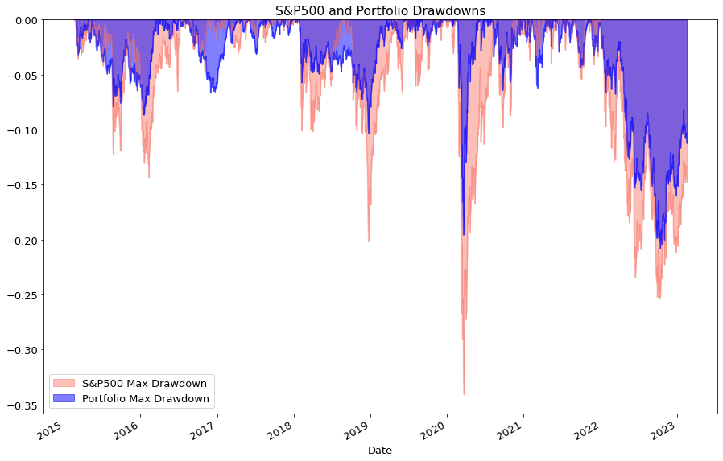
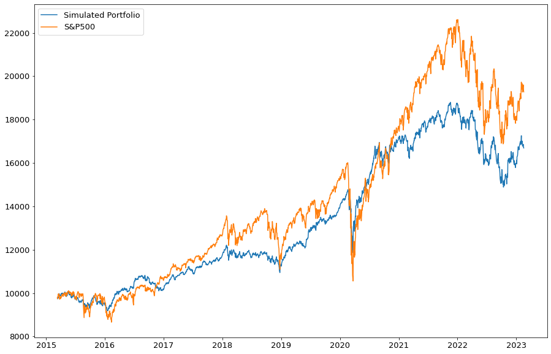
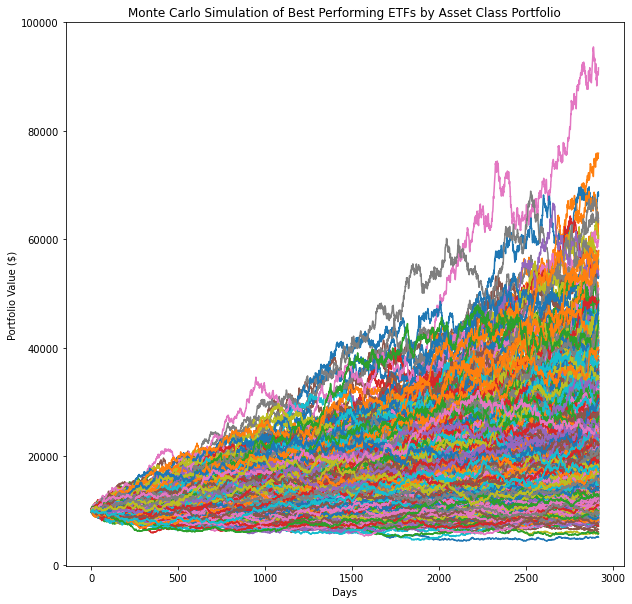
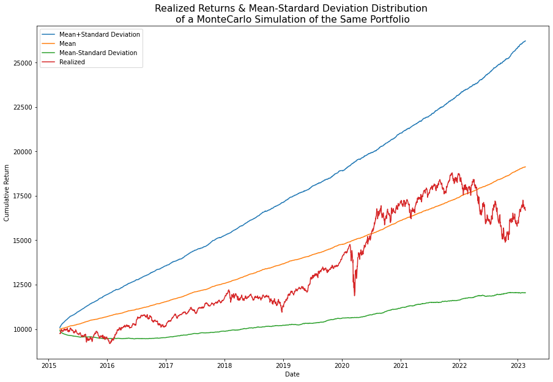
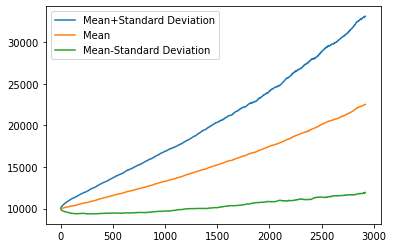

# Portfolio Monte Carlo Simulation for Performance Assessment

## Project Overview
This project applies a Monte Carlo simulation to assess the performance of a long-only portfolio consisting of top-performing ETFs across asset classes, selected based on 2015 data. The study has two main objectives:

1. **Performance Assessment (2015-2023)**:
   - Evaluate the portfolio's performance from 2015 to 2023, comparing it to the S&P 500 in terms of Sharpe ratios and drawdown metrics.
   - Assess two portfolio compositions: a **discretionary weighting** of ETFs based on conventional knowledge and an **equal-weight allocation**.

2. **Monte Carlo Simulation Accuracy**:
   - A Monte Carlo simulation based on pre-2015 returns forecasts portfolio performance from 2015 to 2023. This allows for a comparison between simulated and actual portfolio performance, using mean and ±1 standard deviation bounds from the simulation.

Results highlight the portfolio’s favorable risk-adjusted returns and superior drawdown protection compared to the S&P 500, despite lower absolute price appreciation. Additionally, actual performance aligns within the Monte Carlo simulation’s forecast bounds, though with slight overestimation.

## Installation and Requirements
The project requires the following Python libraries:
- `pandas` for data handling
- `numpy` for numerical operations
- `pandas_datareader` and `yfinance` for accessing financial data
- `matplotlib` for data visualization

Install dependencies using:
```bash
pip install pandas numpy pandas_datareader yfinance matplotlib
```

## Usage
1. **Load Portfolio Data**  
   The portfolio ticker symbols and discretionary weights are specified in `"ETFsList.csv"`, located in the `data` folder. Load data using:
   ```python
   import pandas as pd
   ETFsList = pd.read_csv("data/ETFsList.csv")
   ```

2. **Run Monte Carlo Simulation**  
   The Monte Carlo simulation function, `mc_simulation`, generates simulated portfolio performance based on pre-2015 returns. The simulated performance bounds are compared with actual performance for validation.

3. **Performance Metrics and Visualization**  
   - Calculate Sharpe ratios, drawdowns, and analyze results for both discretionary and equal-weight portfolio compositions.
   - Generate plots to compare actual and simulated performance over the 2015-2023 period.

## Results Summary
Key findings include that, while the ETF portfolio’s price appreciation is lower than the S&P 500’s, it demonstrates superior risk-adjusted returns and better drawdown protection. Additionally, actual performance aligns closely with the Monte Carlo simulation, falling within the ±1 standard deviation bounds.

### Sample Output

*Figure 1. Drawdown comparison between ETF portfolio and S&P 500*


*Figure 2. Price series comparison between ETF portfolio and S&P 500*


*Figure 3. Monte Carlo simulation results for ETF portfolio (2015-2023)*


*Figure 4. Comparison of realized vs. simulated portfolio performance*


*Figure 5. Comparison of simulated performance between discretionary and equal-weight portfolios*


*Figure 6. Simulation forecast mean and ±1 standard deviation bounds*

## Files in this Repository
- **Portfolio_Monte_Carlo_Simulation_Performance_Assessment.ipynb** - Jupyter notebook containing the code for simulation and performance assessment.
- **data/ETFsList.csv** - CSV file with ETF tickers and discretionary weights for the portfolio.
- **docs/Monte_Carlo_Portfolio_Assessment_Simulation_Quality.pdf** - PDF file with detailed methodology for Monte Carlo simulation and performance analysis (to be added).
- **figures/** - Folder containing figures that illustrate results, including comparisons of actual vs. simulated performance.

## License
This project is not licensed.
